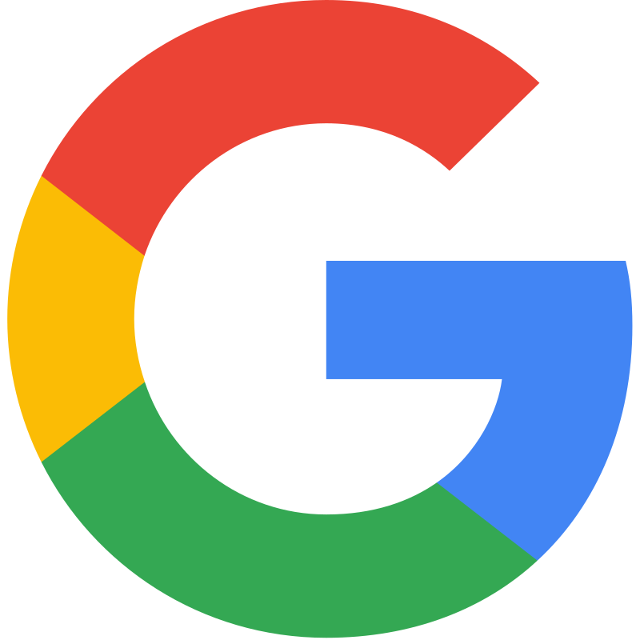

  

  
  
  

 
  
 
    
    <h1 align="center">Melhores Tecnologias <3</h1>
     
    
    
  

    
    
  <h1 align="center">Redes Sociais e contato</h1>

      
     
      
  

<!--
**gilmarSantana/gilmarSantana** is a ✨ _special_ ✨ repository because its `README.md` (this file) appears on your GitHub profile.

Here are some ideas to get you started:

- 🔭 I’m currently working on ...
- 🌱 I’m currently learning ...
- 👯 I’m looking to collaborate on ...
- 🤔 I’m looking for help with ...
- 💬 Ask me about ...
- 📫 How to reach me: ...
- 😄 Pronouns: ...
- ⚡ Fun fact: ...
-->
